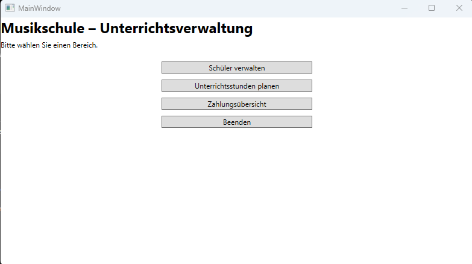
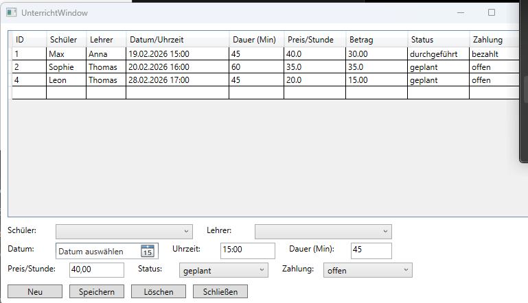

# Musikschule – Unterrichtsverwaltung
[](https://github.com/erhan78/musikschule-unterrichtsverwaltung/actions/workflows/dotnet-tests.yml)

**Autor:** Erhan Dereli

## Kurzbeschreibung
Dieses Projekt ist ein Verwaltungssystem für eine Musikschule. Musiklehrer können Schüler verwalten, Unterrichtsstunden planen und den Zahlungsstatus der Stunden verfolgen. Die Daten werden über Entity Framework Core in einer SQLite-Datenbank gespeichert.

## Voraussetzungen
- Windows
- .NET 9 SDK (für Entwicklung)
- (Für Nutzer der Release-Version: keine zusätzliche Installation nötig, siehe Release)

## Installation & Start (Entwicklung)
1. Repository klonen:
   ```bash
   git clone https://github.com/erhan78/musikschule-unterrichtsverwaltung.git

## Kurze Dokumentation: So nutzt du das Programm

1. **Programm starten**
   - Starte die Anwendung (GUI). Beim ersten Start wird automatisch eine SQLite-Datenbank erstellt und mit Beispieldaten gefüllt.

2. **Hauptmenü**
   - Im Hauptfenster wählst du aus, was du machen möchtest (z.B. Schüler verwalten oder Unterricht planen).

   

3. **Unterricht planen**
   - Öffne „Unterrichtsstunden planen“.
   - Wähle **Schüler** und **Lehrer** aus.
   - Setze **Datum**, **Uhrzeit**, **Dauer** und **Preis pro Stunde**.
   - Wähle **Status** (geplant/durchgeführt/abgesagt) und **Zahlungsstatus** (offen/bezahlt).
   - Klicke auf **Speichern**, um die Stunde anzulegen. Über **Löschen** kannst du markierte Einträge entfernen.

   

4. **Screencast**
   - Eine kurze Video-Demo findest du hier:
   [Screencast ansehen](Dokumentation/screencast.mp4)
